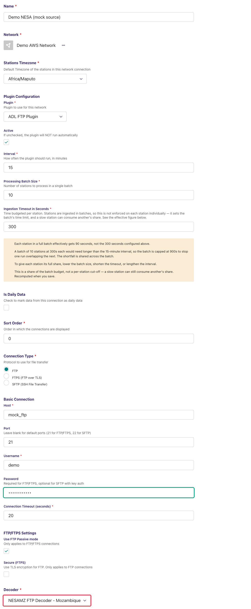
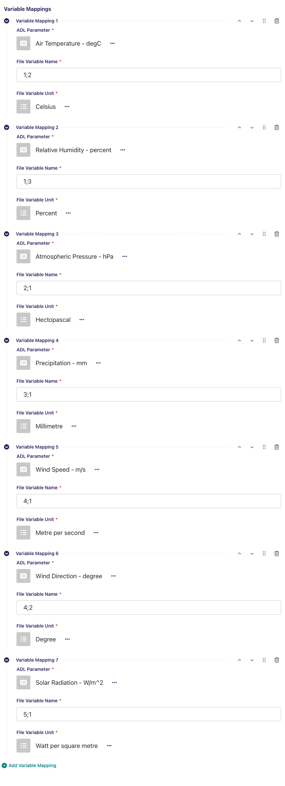
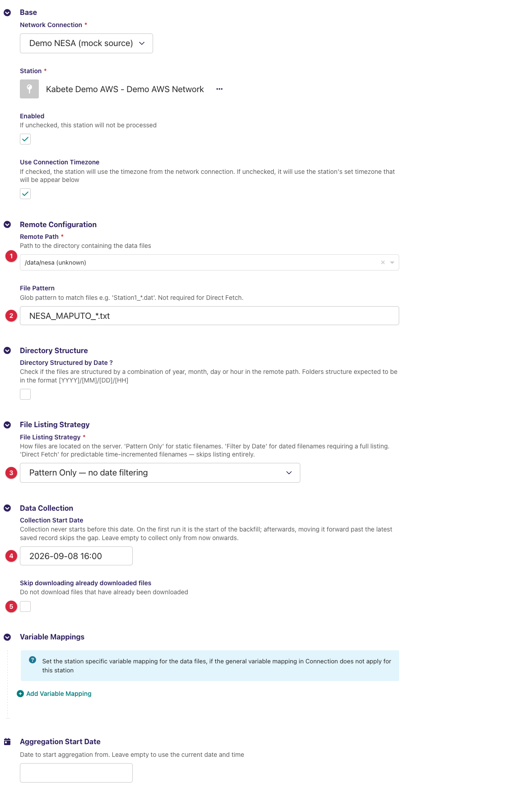
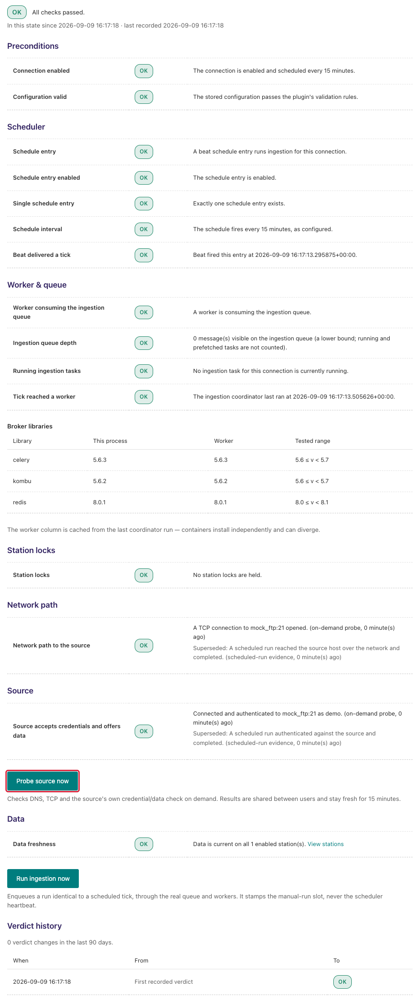
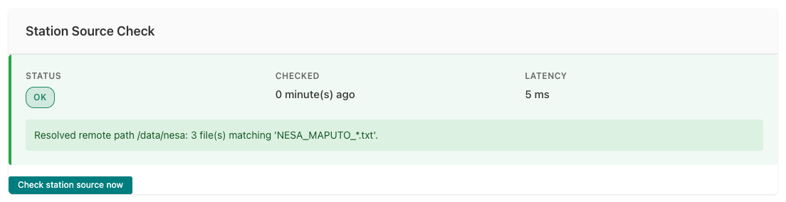
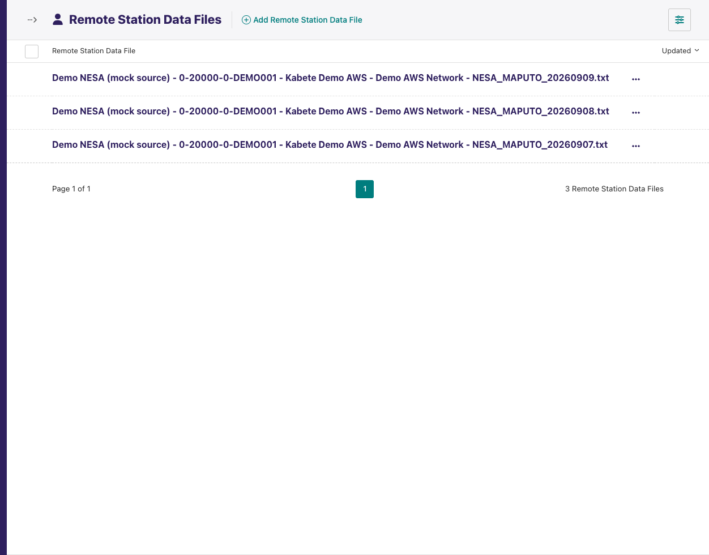

---
adl_plugin:
  name: ADL NESA MZ Decoder
  connects_to: FTP decoder for NESA station files
  category: country
  country: Mozambique
  country_flag: "🇲🇿"
---
# ADL NESA MZ Decoder

Adds a **decoder** to the [ADL FTP Plugin](https://github.com/wmo-raf/adl-ftp-plugin)
for the record files that the **NESA** automatic weather stations of
Mozambique's INAM (Instituto Nacional de Meteorologia) deliver over FTP: one
line per record, framed by `S,` and `#`, with the timestamp split into six
fields followed by `sensor id, channel id, value` triplets. With this plugin
installed, an ADL FTP/SFTP connection can select **NESAMZ FTP Decoder -
Mozambique** as its decoder and collect those files like any other FTP source.

**Repository:** [adl-mz-nesa-decoder](https://github.com/inam-mz/adl-mz-nesa-decoder)
**Plugin type identifier:** `adl_mz_nesa_decoder` (defined but not registered — see below)
**Decoder identifier:** `nesamz` · **Decoder display name:** *NESAMZ FTP Decoder - Mozambique*
**Connection model:** none of its own — uses the FTP plugin's `NetworkFTP` · **Station link model:** the FTP plugin's `FTPStationLink`

> **About the screenshots.** Every image in this guide is regenerated from
> `docs/screenshots.yml` against a seeded demo instance, so hostnames, station
> names, ids and readings in them are placeholders — not values to copy. The
> field tables are the reference for what to enter.

## Overview

This is a *decoder plugin*: it defines no connection or station link of its
own and never talks to a server. The FTP plugin does the listing and
downloading; this plugin turns each downloaded file into observation records.

```
NESA station ──▶ FTP server ──▶ ADL FTP Plugin (list, match, download)
                                          │
                                          ▼
                       NESAMZ FTP Decoder - Mozambique (this plugin)
                                          │
                                          ▼
                       records ──▶ variable mappings ──▶ ADL observations
```

The package ships a placeholder `Plugin` class (`adl_mz_nesa_decoder`) but
never registers it, so it does not appear in the *Add connection* plugin
chooser. The connection's plugin is *ADL FTP Plugin*; this plugin appears only
as an entry in that connection's **Decoder** list. Everything about hosts,
credentials, paths, listing strategies, downloads and the monitoring screens
is documented in the
[ADL FTP Plugin guide](https://github.com/wmo-raf/adl-ftp-plugin/blob/main/docs/guide.md);
this guide covers what is specific to the NESA files.

## Prerequisites

- A running ADL instance with the **ADL FTP Plugin** installed (this plugin
  imports from it and cannot load without it).
- FTP/SFTP access to the server the stations deliver to — host, port,
  account, and the directory holding the files (see the FTP plugin guide's
  prerequisites for the network side).
- The NESA sensor/channel id pairs each station transmits and their units,
  from INAM's station configuration — the pair is the variable name you map.

## Installation

Installed like any ADL plugin — see [Plugin Installation](https://adl-tool.readthedocs.io/en/latest/developer_guide/plugins/plugin_installation.html) for
all methods. Both entries are needed in `plugins.toml`, the FTP plugin first:

```toml
[[plugins]]
name = "ADL FTP Plugin"
git  = "https://github.com/wmo-raf/adl-ftp-plugin.git"
tag  = "0.13.0"

[[plugins]]
name = "ADL NESA MZ Decoder"
git  = "https://github.com/inam-mz/adl-mz-nesa-decoder.git"
tag  = "0.0.1"
```

After rebuild/restart, confirm both appear in `docker compose exec adl
list-plugins`, and that *NESAMZ FTP Decoder - Mozambique* is offered in the
Decoder list of a new FTP connection.

## The file format this decoder reads

| Aspect | Expected |
|---|---|
| File name | Not constrained by the decoder. Match it with the station link's *File Pattern*; if the station puts a date in the name, *Filter by Date* can narrow it. |
| Line | `S,<record id>,<HH>,<MM>,<SS>,<DD>,<MM>,<YYYY>,<id1>,<id2>,<value>,<id1>,<id2>,<value>,…,#` — for example `S,000011,15,00,00,25,09,2025,1,2,35.3,1,3,35.0,1,4,35.5,#`. The leading `S,` and trailing `#` are optional; blank lines are ignored. |
| Timestamp | Hour, minute, second, day, month, year as six separate fields, read as the station's local time (the connection's *Stations Timezone*, or the station link's own). |
| Values | After the eight header fields, groups of three: sensor id, channel id, reading. Each group becomes a variable named **`<id1>;<id2>`** (the two ids joined by a semicolon, e.g. `1;2`). A reading that is not a number is stored as missing for that variable, with a warning. A trailing incomplete group is ignored. |
| Record id | Carried on the record as `record_id`; not an observation. |
| Rows | A line with fewer than eight fields, or an unparseable timestamp, is skipped with a warning. |

## Connection configuration

Create a **Network FTP/SFTP** connection exactly as the FTP plugin guide
describes (connection type, host, port, username, password, passive mode,
timeout), then:

| Field | Value for this source |
|---|---|
| Decoder | **NESAMZ FTP Decoder - Mozambique** |
| CSV Configuration | Leave empty — this decoder needs no configuration. |
| Variable Mappings | One row per `id1;id2` pair to store (below). Connection-level mappings apply to every station on the connection; if the id pairs differ per station, use station-level mappings instead (FTP plugin guide). |



### Variable mappings

| Field | Description |
|---|---|
| ADL Parameter | The ADL `DataParameter` the values are stored under. |
| File Variable Name | The sensor id and channel id joined by a semicolon, **exactly** as the decoder builds it: `1;2`, `1;3` … — no spaces. |
| File Variable Unit | The unit the station transmits that channel in; ADL converts to the ADL parameter's unit. |

**Example (illustrative ids — use the ones in your files):** ADL Parameter
`Air Temperature` ← File Variable Name `1;2`, unit `degC`.

The FTP plugin's **Test Decoder Configuration** action on the connection row
decodes one uploaded file with this decoder and shows the records — the
quickest way to read the id pairs off a real file before typing the mappings.



## Station link configuration

Create an **FTP/SFTP Station Link** per station (all fields are the FTP
plugin's; only the values matter here):

| Field | Value for this source |
|---|---|
| Remote Path | The directory the station's files are written into. |
| File Pattern | A glob selecting one station's files, e.g. `NESA_MAPUTO_*.txt`. |
| Directory Structured by Date | Off, unless the files are nested by date on your server. |
| File Listing Strategy | **Pattern Only** for a small directory; **Filter by Date** with the matching *Filename Date Format* if the file names carry a date. This decoder does no date narrowing of its own. |
| Collection Start Date | Records older than this are rejected by ADL even when the file is fetched. Set it for a backfill. |
| Skip downloading already downloaded files | **Off** if the station appends to a running file, so it is re-downloaded each run (already-saved records are not duplicated); on if each file is written once. |



## Admin UI added by this plugin

None. This plugin adds no page, menu entry, button or form of its own; the
only place it appears is as an option in the FTP connection's *Decoder*
select. The FTP plugin's own surfaces — *Test Decoder Configuration*, the
*Direct Fetch Files* preview, the *FTP station data files* list — work with
this decoder and are documented in the FTP plugin guide.

## Data collection behavior

One run, per enabled station link:

1. The FTP plugin lists *Remote Path* and keeps the names matching *File
   Pattern* (narrowed by file-name date under *Filter by Date*).
2. Each file not yet held (or every file, with *Skip downloading already
   downloaded files* off) is downloaded and handed to this decoder.
3. The decoder strips the `S,` / `#` framing from each line, reads the six
   timestamp fields, walks the id/id/value triplets and yields one record per
   line, keyed `id1;id2`.
4. ADL applies the variable mappings and unit conversion and stores the
   values; rows already stored are updated, not duplicated.

- **Timezones:** the six timestamp fields are local station time; the
  station's timezone (connection default or per-link) is what ADL stamps them
  with.
- **Backfill:** set *Collection Start Date* before the first run.

## Source checks / diagnostics

All monitoring for a connection using this decoder is the FTP plugin's: the
**Ingestion Diagnostic** page proves the FTP host, port and account, and the
station link's **Station Source Check** proves the resolved remote path and
counts the files matching the pattern. How to read both screens is covered in
[Monitoring & Diagnostics](https://adl-tool.readthedocs.io/en/latest/user_guide/monitoring_and_diagnostics.html);
their FTP-specific messages are catalogued in the FTP plugin guide. This
plugin adds no check of its own — a file that lists and downloads fine but
decodes to nothing shows up as a **warning in the task log** with a zero
*values saved* count, not in the source checks.







### Feedback catalogue — messages involving this decoder

The decoder's own messages go to the worker log (`docker compose logs
adl_celery_worker_adl`); the FTP plugin's wrap-around messages appear in the
station's activity log and task log:

| Message (example) | Where | Meaning | What to do |
|---|---|---|---|
| `Skipping invalid line: 000011,15,00,00,25` | worker log (warning) | A line with fewer than eight comma-separated fields — a truncated record or a non-data line. | Open the file; nothing to configure unless every line is affected. |
| `Error parsing line: 000011,15,00,00,31,02,2025,… Error: day is out of range for month` | worker log (error) | The six timestamp fields do not form a valid date/time. | A logger clock fault; the line is skipped. |
| `Could not convert value 'NaN' for key 1;2` | worker log (warning) | A reading in a triplet is not numeric; it is stored as missing. | Normal for a sensor reporting an error marker. |
| `File NESA_MAPUTO_20250925.txt decoded 0 record(s) but none of its values were saved — check the variable mappings and the ingestion window` | task log (warning) | Every line was skipped by one of the warnings above. | See the preceding warnings. |
| `File … decoded 96 record(s) but none of its values were saved — …` | task log (warning) | Records parsed, but no mapped `id1;id2` matched, or all lie before *Collection Start Date*. | Use *Test Decoder Configuration* to see the emitted keys; check the start date. |
| `Resolved remote path /nesa: 0 file(s) matching 'NESA_MAPUTO_*.txt'.` | Station Source Check (OK) | The FTP plugin's station check: path found, nothing matches right now. | Check the pattern and that files exist on the server. |

## Troubleshooting

**Files decode but *values saved* is 0**
: The *File Variable Name* is not in the `id1;id2` form (a space after the
  semicolon, or only one id). Use *Test Decoder Configuration* on the
  connection to see the exact keys.

**Observation times are shifted by a few hours**
: The timestamp is read in the station's timezone. Check the connection's
  *Stations Timezone* and the station link's override.

**A running file stops updating in ADL after the first fetch**
: *Skip downloading already downloaded files* is on. Turn it off for a
  growing file.

## Compatibility

| Plugin version | Requires | Notes |
|---|---|---|
| 0.0.1 | ADL FTP Plugin (imports its decoder registry; written against 0.13.0), ADL core 0.8.x | Current release. Uses the base decoder's file matching, so it accepts the dated `get_matching_files()` call of FTP plugin 0.10.0 and later. Needs `pandas` (present in the ADL core image). |

## Changelog

See [GitHub Releases](https://github.com/inam-mz/adl-mz-nesa-decoder/releases).
